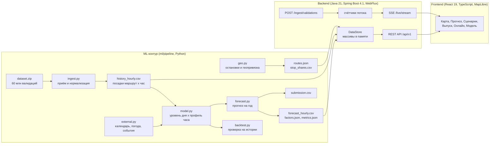

# Архитектура

Решение состоит из трёх частей: ML-контур на Python, backend на Java и frontend на React. Они связаны через набор файлов-артефактов: Python считает прогноз и кладёт результат в `ml/artifacts/`, backend при старте загружает эти файлы в память и отдаёт их через REST API, frontend показывает всё на карте и графиках.

## Модули

| Шаг | Где | Что делает |
|---|---|---|
| Приём и нормализация | `ml/pipeline/ingest.py` | Читает `train.csv` и `test.csv` из архива организаторов потоково (DuckDB), оставляет успешные валидации, берёт время из `tran_date_time`, номер маршрута из `ngpt_route`, агрегирует до маршрут x дата x час. Сверяет результат с разметкой организаторов. |
| Геопривязка | `ml/pipeline/geo.py` | Собирает трассы и остановки всех 10 маршрутов (справочник организаторов и OpenStreetMap), отмечает остановки у метро и вокзалов, распределяет посадки маршрута по остановкам. |
| Внешние факторы | `ml/pipeline/external.py` | Производственный календарь, школьные каникулы Москвы, погода Open-Meteo, ремонты и запуски маршрутов из новостей. |
| Модель | `ml/pipeline/model.py` | Уровень дня по маршруту, поправки на календарь и погоду (гребневая регрессия scikit-learn), профиль по часам. |
| Проверка | `ml/pipeline/backtest.py` | Скользящие окна на истории, вклад каждого внешнего источника. |
| Прогноз | `ml/pipeline/forecast.py` | Прогноз на 365 дней по часам с интервалами p10-p90, файл для платформы. |
| API | `backend/` | Агрегация по маршрутам, остановкам, интервалам и горизонтам, корректирующие коэффициенты, выгрузка CSV и XLSX, рекомендации по выпуску, приём потока валидаций. |
| Интерфейс | `frontend/` | Карта с динамикой по часам, графики прогноза, ползунки поправок, онлайн-поток, качество модели. |

## Почему так

- Прогноз считается заранее, а API только складывает готовые почасовые значения. Поэтому ответ на любой запрос укладывается в миллисекунды, и backend не зависит от Python во время работы.
- Артефакты лежат в обычных CSV и JSON рядом с кодом. Их можно открыть в Excel, сравнить в git и пересчитать одной командой.
- Backend не хранит состояние, кроме счётчиков онлайн-потока. Для горизонтального масштабирования достаточно поставить несколько экземпляров за балансировщиком: у всех одинаковые артефакты. Счётчики потока в таком режиме нужно вынести в общее хранилище (Redis или ClickHouse), это указано в плане развития.

## Поток данных в реальном времени

Валидации приходят на `POST /api/v1/ingest/validations` пачками в формате датасета (CSV или JSON). Backend проверяет каждую запись, отбрасывает отказы, раскладывает посадки по маршруту и часу в неблокирующие счётчики. Страница «Онлайн» получает сводку через Server-Sent Events раз в 2 секунды и сравнивает факт с прогнозом. Для демонстрации в backend встроен генератор, который шлёт синтетические валидации через тот же приёмник.
